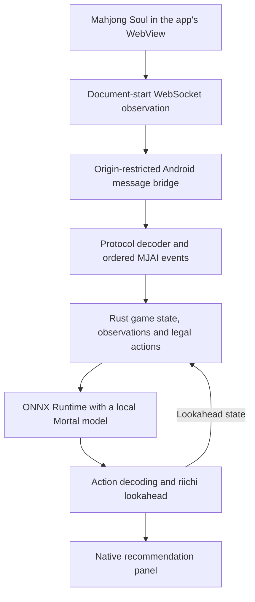

This plan targets a self-contained Akagi-NG app for Android 16 on a Samsung Galaxy A54 5G with 8 GB RAM and 256 GB storage. The first game is Mahjong Soul, based on the requested Yostar and Google login methods. Research date: 2026-09-24.

The recommendation is **Kotlin and Jetpack Compose for the app, an embedded Android WebView for the game, a Rust rules/observation core, and ONNX Runtime for local Mortal inference**. Ship the supported models inside the APK. The game still uses the internet; model inference and saved-trace analysis run on the phone.

This is a researched implementation proposal. Source inspection and checkpoint metadata inspection were completed; no Android prototype, model conversion, compilation, installation, or device benchmark was performed. Several research agents were launched; service rate limits interrupted some runs, and the remaining research was completed directly.

**What the repository already provides.** Desktop Akagi-NG already hosts its own Chromium game window. `electron/src/window-manager.ts:303` creates it, and `electron/src/game-handler.ts:109` attaches Electron's debugger to observe its WebSocket traffic. The Android project needs a replacement for this desktop integration. The Python backend and desktop native extensions also need a mobile implementation.

| Existing component | Android treatment |
| --- | --- |
| Electron game window, debugger capture, window/HUD controls | Replace with one Android Activity, a game WebView, document-start capture, and a native advice panel. |
| `akagi_backend/akagi_ng/bridge/majsoul/` and `assets/liqi.json` | Preserve protocol behavior and schema; port the decoder and game-event conversion, with the existing implementation as a reference. |
| `mjai_bot/engine/mortal.py` and `mjai_bot/network.py` | Use as the reference for model export and numerical parity. Android executes the exported graph. |
| `lib/libriichi*` and `core/lib_loader.py` | Replace desktop CPython extensions with an Android ARM64 native core built from compatible source. |
| `mjai_bot/bot.py`, `lookahead.py`, and `utils.py` | Preserve action decoding, recommendation semantics, and riichi lookahead. |
| Frontend recommendation types, tile assets, translations, and display behavior | Reuse as the data/design reference for a phone UI. Replace Electron IPC and HTTP/SSE transport with calls and events within the app. |
| `.github/workflows/build.yml` | Add a separate Android build and validation workflow. This source snapshot has no Git metadata, so an appropriate repository/fork is needed before CI can run. |

The installed [no-local-compilation skill](C:/Users/CIRILO/.agents/skills/no-local-compilation/SKILL.md) requires compilation/builds to run through GitHub Actions. Implementation must follow that constraint. Installing and measuring an APK produced by Actions on the A54 is a separate device-validation step.

**The proposed runtime.** Keep the game and recommendations in the same app. A native panel beside or below the game provides the HUD without a system-wide overlay. Keep model execution off the UI thread and process game events through one ordered queue.

Android WebView is a browser view hosted by this application, backed by the phone's installed WebView provider. It does not require connecting to a separate browser, but its engine is not physically bundled in the APK. If bundling the browser engine itself becomes a firm requirement, Mozilla's GeckoView is an alternative to evaluate, with package-size, memory, maintenance, and game-compatibility costs. GeckoView does not by itself establish complete WebSocket capture or embedded Google-login support. [Android WebView documentation](https://developer.android.com/develop/ui/views/layout/webapps/webview), [GeckoView overview](https://mozilla.github.io/geckoview/)

**Login has a documented route.** Implement and test Yostar's supported sign-in inside the game browser, including verification, cookies, web storage, and app relaunch. Google's OAuth policy restricts authorization in developer-controlled embedded browsers. A direct Google button inside our WebView cannot be assumed to work. [Google OAuth policy](https://developers.google.com/identity/protocols/oauth2/policies#use-secure-browsers)

Yostar's official Mahjong Soul FAQ describes binding an existing Google account to a Yostar account: log into the existing game account, open Settings → Others → Account Settings, choose the unbound account option, and complete verification. The target Yostar account must never have been connected to Mahjong Soul. For a Google-origin account, this supplies the supported preparation step before using Yostar login in the new app. Confirm that the same player ID and progress appear; do not accidentally create a different game account. An account that is already bound can proceed directly to Yostar login. [Yostar's published FAQ, Account Binding entry](https://mahjongsoul.yo-star.com/api/faq/list)

A direct Google sign-in experience would be a separate integration investigation. Opening a system browser alone does not establish a supported way to transfer a third-party game's authenticated session into WebView. The initial plan uses the documented Yostar binding route for Google-based accounts.

**Browser capture must pass an early feasibility test.** Register `WebViewCompat.addWebMessageListener` and `addDocumentStartJavaScript` before the first game navigation, checking the required WebView feature flags at runtime. AndroidX documents execution before page JavaScript and availability of the message object first. Use narrowly scoped game origins and validate the native messages. [AndroidX WebViewCompat](https://developer.android.com/reference/androidx/webkit/WebViewCompat)

The injected script observes the original WebSocket constructor, send calls, received messages, and closure while preserving normal game behavior. It must handle text, ArrayBuffer, typed-array views, and Blob payloads. Async conversions must preserve message order. Include connection identity, URL, direction, payload type, sequence number, and document/session generation. The current desktop ingestion drops `requestId` when creating backend messages (`dataserver/api.py:214`); the Android contract must retain it.

Document-start hooks cover matching document frames, not automatically worker environments. Determine whether the current game creates sockets in dedicated/shared workers, opaque frames, or popup windows. Those paths need explicit coverage and validation if encountered. JavaScript supplies application messages rather than a general debugger stream, so compare the resulting decoded events against the desktop parser. `shouldInterceptRequest` is not a documented WebSocket message-payload API. [Android WebViewClient reference](https://developer.android.com/reference/android/webkit/WebViewClient)

On message loss, unrecognized protocol data, or stale session state, stop displaying advice until a verified resynchronization completes. Reinstall capture before navigation whenever a renderer is recreated. Test disconnection, reload, background/resume, and renderer loss. Android documents renderer termination and recovery as cases apps need to handle. [WebView lifecycle guidance](https://developer.android.com/develop/ui/views/layout/webapps/managing-webview)

**The bundled models give a concrete conversion baseline.** Read-only inspection of the checkpoint ZIP/pickle metadata found the following. Metadata was inspected without loading or executing the checkpoint. Input dimensions below follow the first convolution's stored dimensions and the network's 34-tile axis; verify them against the matching native encoder in CI.

| Checkpoint | File size | Network metadata | Planned observation shape | Legal-action mask |
| --- | ---: | --- | --- | --- |
| `models/mortal.pth` | 5,123,618 bytes | v4, 32 channels, 2 residual blocks, `current_dqn` | `[1, 1012, 34]` | `[1, 46]` |
| `models/mortal3p.pth` | 5,024,765 bytes | v4, 32 channels, 2 residual blocks, `current_dqn` | `[1, 775, 34]` | `[1, 44]` |

The stored DQN heads have 47 and 45 outputs before splitting value from advantages. The different observation layouts demonstrate why three-player support needs its own compatible encoder and action map. File size does not establish playing strength or measured inference speed.

Export each supported model in CI using this repository's exact network definitions in evaluation mode. Preserve the observation layout, normalization, legal mask, value/advantage calculation, and final masking. In particular, `network.py:253` averages advantages over legal actions. Start with FP32 and deterministic inference, matching the current resource defaults. Compare legal scores and decoded decisions against the real PyTorch baseline before optimizing.

Use the Android ONNX Runtime package with its CPU execution provider for the correctness baseline. Then benchmark XNNPACK against it on the A54, checking actual operator coverage and thread contention. The model contains Conv1d, Mish, attention, reductions, and masking; an accelerator's presence does not prove it will accelerate the whole graph. Keep CPU execution available for unsupported operations. ONNX Runtime's guidance supports Android deployment and recommends measuring model-specific provider behavior. [ONNX Runtime mobile guidance](https://onnxruntime.ai/docs/tutorials/mobile/), [XNNPACK provider](https://onnxruntime.ai/docs/execution-providers/Xnnpack-ExecutionProvider.html)

Treat the reported "Exynos 180" as a likely reference to Exynos 1380, subject to device diagnostics. Samsung documents Cortex-A78/A55 CPU cores and a five-core Mali-G68 for Exynos 1380. Use measured CPU performance as the initial decision criterion; GPU/NPU capability is not evidence of Mortal runtime compatibility. [Samsung Exynos 1380 specifications](https://semiconductor.samsung.com/processor/mobile-processor/exynos-1380/)

Load only the active model and share its inference session with lookahead. Add larger v4 models through a validated model bundle containing the graph, model version, player count, input/output shapes, score semantics, source identifier, checksum, and notices. Conversion happens before installation; Android does not need to execute arbitrary Python checkpoints. Versions 1–3 and the loader's `policy_net`/GroupNorm variants need explicit exporters and separate validation before being advertised as supported.

**The native core is the largest source dependency.** This checkout contains CPython 3.12 binaries for desktop Windows/Linux x86_64 and macOS ARM64. None is an Android binary. Upstream Mortal source exists, but its current library and bot interface depend on PyO3/Python and NumPy. The port must isolate game rules, state updates, observations, legal masks, and action conversion behind a small Android JNI interface. Merely rebuilding the existing Python extension for ARM64 does not remove the Python dependency. [Mortal library manifest](https://github.com/Equim-chan/Mortal/blob/main/libriichi/Cargo.toml), [Mortal bot implementation](https://github.com/Equim-chan/Mortal/blob/main/libriichi/src/mjai/bot.rs)

Pin a source revision and compare it with the actual bundled engine. The inspected upstream four-player source supports v4's 1012-channel representation. A source revision matching this checkout's `libriichi3p` and 775-channel representation has **not been established**. Searches of the identified maintainer's public Mortal forks did not establish that match. Recovering it, or separately implementing and validating an equivalent native encoder/rules engine, is a prerequisite for claiming three-player compatibility. Do not substitute the four-player encoder or infer compatibility from a filename. [Maintainer's Mortal v4 source](https://github.com/shinkuan/Mortal_v4)

The referenced upstream Akagi project has since developed a different Rust implementation and built-in model. Its current model is not evidence that the Mortal checkpoints in this checkout already run through that implementation. Any reused code from it needs its own compatibility and licensing review. [Current upstream Akagi](https://github.com/shinkuan/Akagi)

Keep riichi lookahead behavior: fork state, replay historical events with inference disabled, apply the hypothetical reach, and perform inference only for the decision being requested. Preserve real-game state and share model resources. Validate red-five handling, calls and kan variants, ron/tsumo/pass, reach declaration and discard, three-player kita, and reconnection replay.

**Implement in stages with reviewable acceptance conditions.** Stages 1 and 2 can investigate browser and model feasibility in parallel. Integration follows only after their relevant checks pass.

| Stage | Concrete work | Acceptance condition |
| --- | --- | --- |
| 0. Establish the baseline | Identify the repository for Actions, pin source/model inputs, locate compatible native source, and generate reference traces with the real desktop parser and engine. | A reproducible baseline exists for 4p; the 3p source or equivalent implementation path is explicitly established before committing to its port. |
| 1. Prove the embedded browser | Build a minimal Android game screen; test Yostar login and a Google-origin account through binding; install early capture and validate frames/workers/popups. | The same player account loads, sessions persist, and complete game/reconnect message sequences are captured and decoded correctly. |
| 2. Prove local Mortal | Export both bundled graphs; package an inference-only Android harness; develop the mobile Rust interface from compatible source. | FP32 outputs match the reference within justified numerical tolerances; masks and action decoding match; the applicable models run on the A54 without an inference server. |
| 3. Integrate a playable app | Port Mahjong Soul protocol conversion, native state/inference coordination, advice display, settings, and riichi lookahead. | Complete 4p and 3p matches, including the edge cases above, produce correct timely advice. Each mode is gated on its own compatible native core. |
| 4. Tune and recover | Measure threads/providers, memory, sustained latency, heat, layout, renderer recovery, app suspension, and reconnection. | The app remains responsive during a sustained session, recovers without stale advice, and satisfies the agreed decision-latency target. |
| 5. Package and deliver | Bundle validated models, protocol resources, notices, and native dependencies; configure signing and publish a CI APK artifact. | Fresh install, update, relaunch, in-app login/gameplay, and an offline saved-trace inference test all succeed. |

Use Mahjong Soul for the initial deliverable. Tenhou can follow through its existing protocol reference. Riichi City and Amatsuki currently require the repository's proxy path; carrying their existing support into an embedded-browser app is a separate investigation.

**Validation needs both CI and the actual phone.** Use recorded application messages as inputs to both old and new protocol converters and compare normalized MJAI events. Use the real native desktop engine in CI to generate observation tensors, legal masks, and decisions; mocked unit tests alone do not establish inference parity. Legal masks must match exactly. For FP32 scores, establish documented absolute/relative tolerances and separately inspect any action-rank changes near numerical ties.

The initial performance goal is normal recommendation latency at the 95th percentile below 500 ms while the game is active. Measure riichi lookahead separately, with an initial target below one second. These are proposed acceptance targets, not measured A54 results. Record cold model load, p50/p95/worst latency, process and renderer memory, frame responsiveness, and changes after at least 30 minutes of use. Benchmark small bundled models and any larger replacement separately. Start by comparing one, two, and four inference threads; only pursue quantization after FP32 parity and actual performance justify it.

Target Android 16 / API 36 and distribute ARM64 for this device. Use an Android Gradle Plugin version that supports API 36 and an NDK/toolchain configuration supporting 16 KB pages. Validate every packaged native library, including ONNX Runtime and transitive dependencies, for ELF and APK alignment; do not infer compliance solely from build settings. Test on the A54 and an available 16 KB Android environment. Android 16 does not imply that this particular phone uses 16 KB pages. Account for edge-to-edge layout, back navigation, WebView lifecycle, keyboard, orientation changes, and safe state restoration. [Android 16 behavior changes](https://developer.android.com/about/versions/16/behavior-changes-16), [Android 16 KB guidance](https://developer.android.com/guide/practices/page-sizes)

Include the existing project, library, and weight notices with the deliverable and establish redistribution terms for any replacement inputs. The checkout's `models/LICENSE` and `lib/LICENSE` contain AGPLv3 with the Commons Clause, so model/native-component provenance belongs in the release inputs.

The first implementation deliverables should be the embedded-browser capture prototype and the real-model/native-core compatibility report. Those settle the biggest uncertainties before committing to the complete app UI and release packaging.
